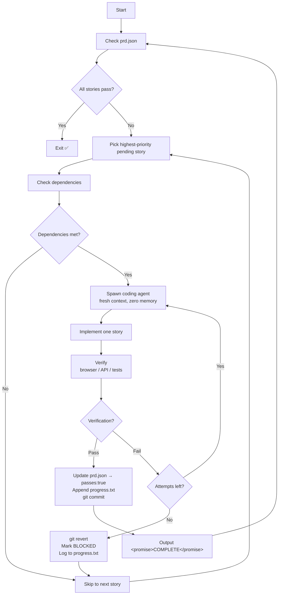
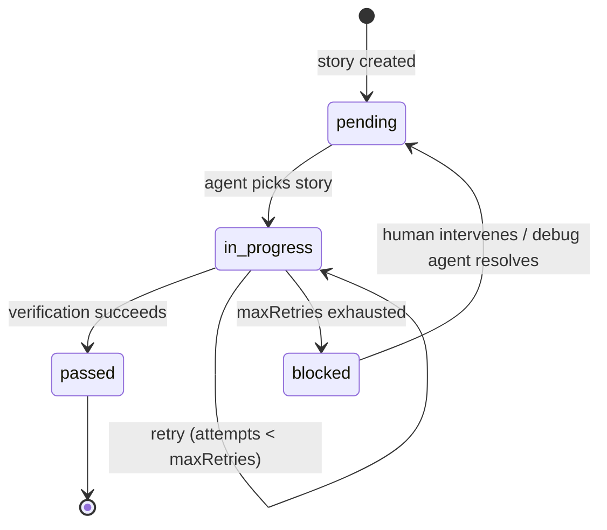

# ⟳ Ralph Loop

> **Deterministic-autonomous AI agent system.** A loop spawns fresh agents with zero context memory until every task is verifiably complete. The only "memory" is the file system.

[](LICENSE)
[]()
[]()
[]()
[]()

---

## TL;DR

```bash
# 1. Install the plugin
git clone https://github.com/1998x-stack/ralph-loop.git
claude plugin install ./ralph-loop --scope local

# 2. In YOUR project, generate a PRD
cd my-project
claude -p "/ralph-loop:generate-prd"

# 3. Initialize for Ralph
claude -p "/ralph-loop:init"

# 4. Run the loop (go AFK, come back to a finished project)
claude -p "/ralph-loop:run"
```

---

## The Problem

LLM context windows have no `free()`. Every tool call and file read accumulates — and after ~70% utilization, agents enter the **Dumb Zone**: hallucinating, forgetting early constraints, making increasingly poor decisions.

Single-session agents degrade. Multi-session agents lose state. Most "autonomous" approaches are fragile.

## The Solution

Ralph Loop never lets an agent enter the Dumb Zone. Every iteration spawns a **fresh agent instance with zero context**. The agent:

1. **Reads** state from files (`prd.json`, `progress.txt`, `AGENTS.md`, git log)
2. **Implements exactly one** user story
3. **Verifies** via browser automation or API tests
4. **Commits** code + updates state files
5. **Outputs** `<promise>COMPLETE</promise>`

The outer loop detects the signal, verifies `prd.json`, and spawns the next iteration. Repeat until all stories pass.



## Features

- **Fresh context per iteration** — No context rot. Subagent isolation guarantees every story starts clean.
- **File-based state machine** — `prd.json` is the single source of truth. `progress.txt` is the cross-session handoff diary. Git is the code snapshot.
- **Browser-verified acceptance** — Frontend stories must pass browser automation (Puppeteer/Playwright). External, reproducible verification.
- **Smart error recovery** — Configurable retry count (default: 3 attempts). Exhausted retries → auto-revert → mark BLOCKED → move on. Failed stories never block progress.
- **Claude Code plugin** — Install once, reuse across projects. Skills, agents, hooks — auto-discovered. Namespaced commands (`/ralph-loop:run`).
- **Dual runtime** — Bash (`ralph.sh`) for simplicity, Node.js (`ralph-node.js`) for programmatic control, hooks for autonomous mode.
- **GitHub Pages** — Live landing page at the repo's Pages URL with architecture overview, flow diagrams, and quick start.

## Quick Start

> **⚠️ Important:** All Ralph commands run from YOUR project directory, not the ralph-loop repo. Ralph reads `prd.json` and other state files from your project root.

### Install as Claude Code Plugin

```bash
git clone https://github.com/1998x-stack/ralph-loop.git
claude plugin install ./ralph-loop --scope local
claude plugin list  # should show ralph-loop
```

### Generate Your PRD

```bash
# In YOUR project directory
cd my-project
claude -p "/ralph-loop:generate-prd"

# This asks 5-10 questions, then generates prd.json
# with 50-200 user stories — each completable in one context window.
```

### Initialize Your Project

```bash
# Still in your project directory
claude -p "/ralph-loop:init"

# Creates:
#   prd.json      — task manifest (if not generated yet)
#   init.sh       — environment bootstrap
#   AGENTS.md     — project conventions
#   progress.txt  — cross-session handoff diary
```

### Run the Loop

```bash
# Autonomous mode (Claude Code) — from your project
cd my-project
claude -p "/ralph-loop:run"

# Standalone CLI (Bash) — from your project
cd my-project
./ralph-loop/bin/ralph --max-iterations 100 --verbose

# Programmatic (Node.js) — from your project
cd my-project
node ./ralph-loop/bin/ralph-node --max-iterations 50 --verbose
```

## Architecture

```
ralph-loop/                     ← plugin root
├── .claude-plugin/
│   └── plugin.json             ← manifest (name, version, components)
├── skills/
│   ├── ralph-loop/SKILL.md     ← /ralph-loop:run (loop coordinator)
│   ├── generate-prd/SKILL.md   ← /ralph-loop:generate-prd
│   └── initialize-project/SKILL.md ← /ralph-loop:init
├── agents/
│   ├── ralph-coding-agent.md   ← per-story subagent (fresh context)
│   ├── ralph-initializer.md    ← one-time project scaffolder
│   └── ralph-debugger.md       ← root cause analyzer (planned)
├── hooks/
│   ├── hooks.json              ← SessionStart + PostToolUse
│   ├── check-prd.sh            ← PRD status scanner
│   └── on-stop.sh              ← completion reporter
├── bin/
│   ├── ralph                   ← CLI (Bash)
│   └── ralph-node              ← CLI (Node.js)
├── templates/
│   ├── CLAUDE.md               ← prompt template
│   ├── AGENTS.md               ← convention manual template
│   ├── prd.json                ← PRD skeleton
│   ├── progress.txt            ← handoff diary template
│   ├── init-node.sh            ← Node.js/Next.js bootstrap
│   └── init-python.sh          ← Python/FastAPI bootstrap
├── .mcp.json                   ← bundled Puppeteer MCP
├── docs/
│   ├── index.html              ← GitHub Pages landing page
│   ├── base-dark.css           ← design system
│   └── adr/                    ← architecture decision records
├── CONTEXT.md                  ← domain language
├── README.md                   ← you are here
└── LICENSE                     ← MIT
```

## Core Constraints

| Rule | Description |
|------|-------------|
| **One story per iteration** | Never more. Each story must fit in one context window. |
| **Browser-verified only** | Frontend stories must pass browser automation. No "looks good to me." |
| **Never delete passing tests** | Tests are the safety net. Never remove a passing test. |
| **Configurable retry** | `maxRetries` field per story (default: 3). Exhausted → `git revert` → BLOCKED. |
| **Git commit every iteration** | Every iteration ends with a clean commit and updated `progress.txt`. |
| **Completion signal required** | `<promise>COMPLETE</promise>` — double-verified against `prd.json`. |

## State Machine



## Documentation

| Doc | Purpose |
|-----|---------|
| [`CONTEXT.md`](CONTEXT.md) | Domain language and term definitions |
| [`AGENTS.md`](AGENTS.md) | Convention manual for this repo |
| [`docs/adr/`](docs/adr/) | Architecture Decision Records |
| [`how-the-loop-works.md`](how-the-loop-works.md) | Loop mechanics deep-dive |
| [`context-strategies.md`](context-strategies.md) | Context window management |
| [`testing-patterns.md`](testing-patterns.md) | E2E verification patterns |
| [`agents/ralph-coding-agent.md`](agents/ralph-coding-agent.md) | Coding agent protocol |
| [`agents/ralph-initializer.md`](agents/ralph-initializer.md) | Init agent guide |
| [`skills/ralph-loop/SKILL.md`](skills/ralph-loop/SKILL.md) | Loop coordinator skill |
| [`docs/index.html`](docs/index.html) | GitHub Pages landing page |

## License

MIT — see [LICENSE](LICENSE).

## Acknowledgments

Based on Geoffrey Huntley's [Ralph Wiggum technique](https://ghuntley.com/ralph/). Inspired by [vercel-labs/ralph-loop-agent](https://github.com/vercel-labs/ralph-loop-agent).
